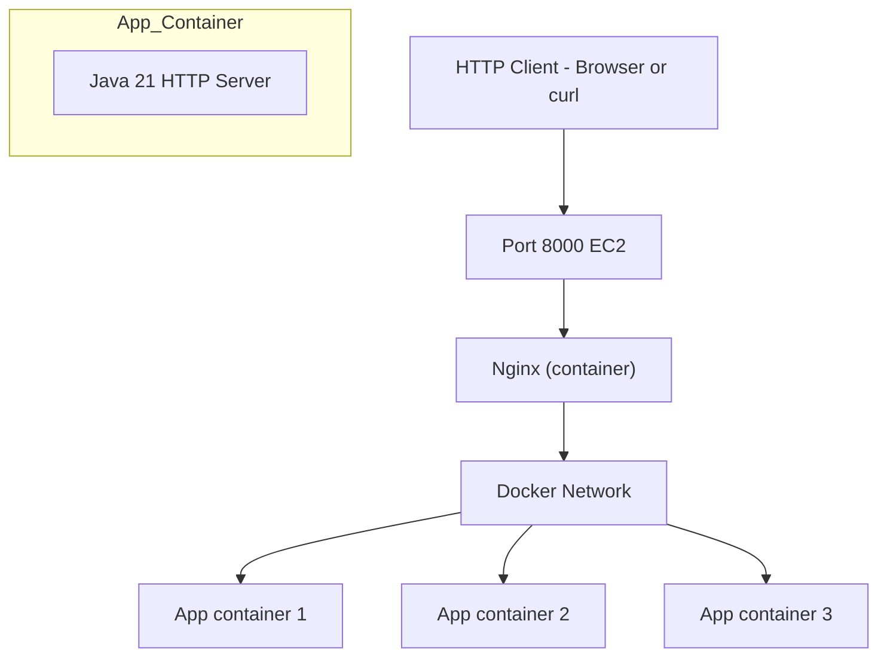
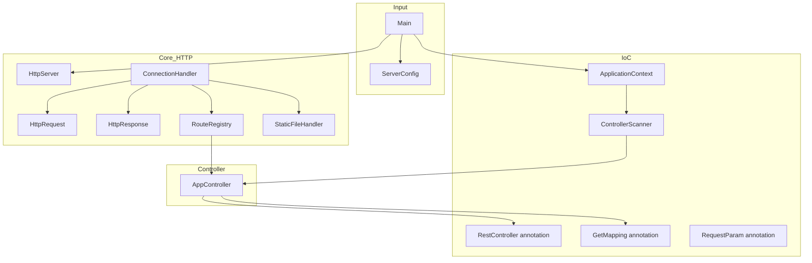
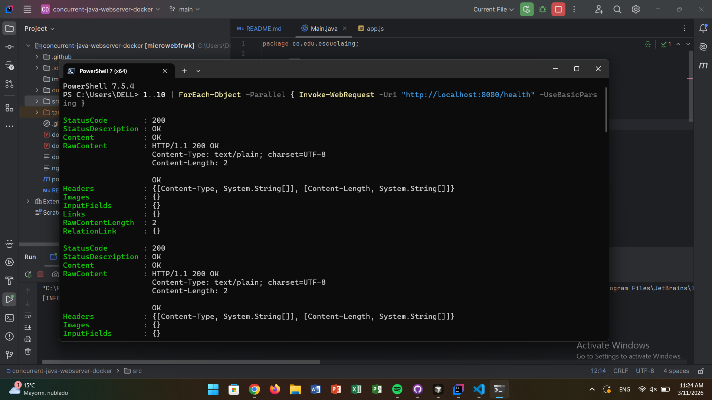
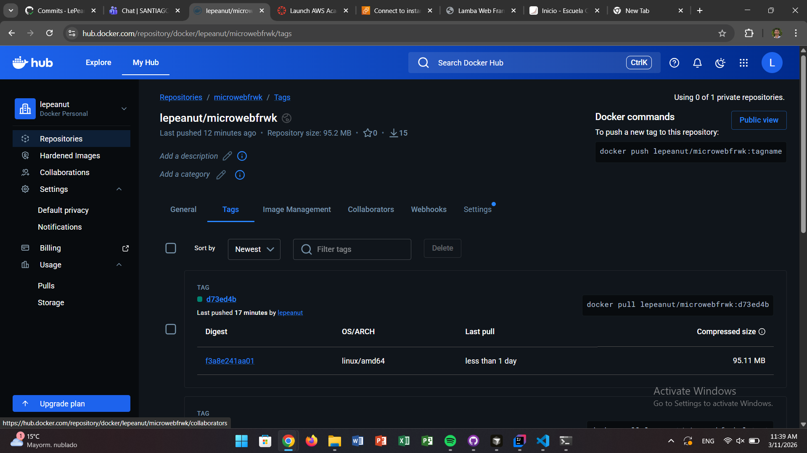
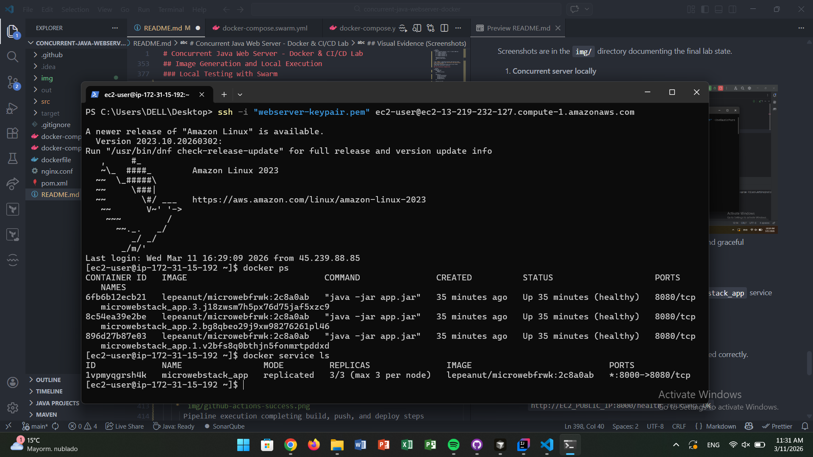
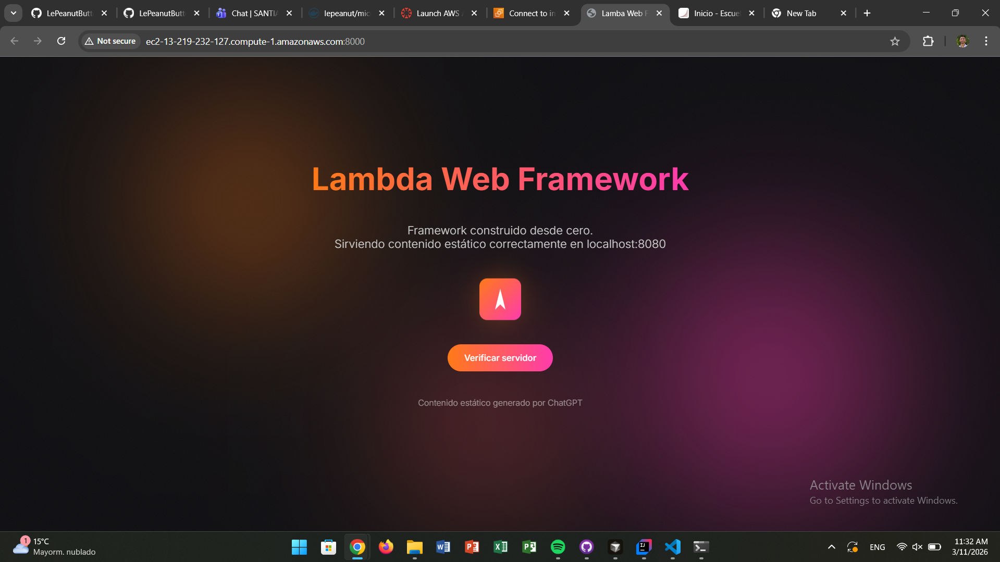
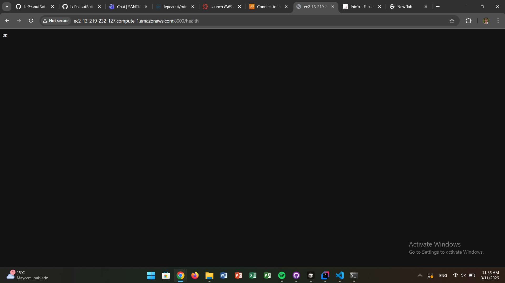
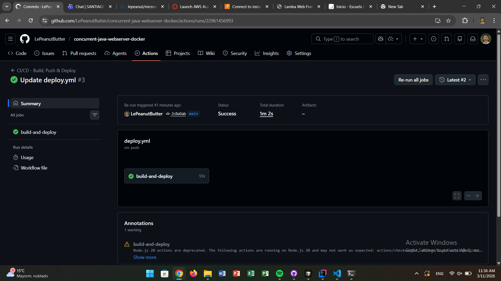

# Concurrent Java Web Server - Docker & CI/CD Lab

**Escuela Colombiana de Ingeniería Julio Garavito**
**Student:** Santiago Botero García

This lab takes an HTTP micro-framework in Java 21 and brings it into a **concurrent** and **production-ready** environment using:

* Concurrency with **virtual threads** and graceful shutdown.
* Containerization with **Docker**.
* Orchestration with **Docker Compose** and **Docker Swarm**.
* Load balancing with **Nginx**.
* **CI/CD pipeline with GitHub Actions**, automatically deploying to **AWS EC2** on physical port **8000**.

## Table of Contents

* [Project Overview](#project-overview)
* [General Architecture](#general-architecture)
* [Relevant Class Design](#relevant-class-design)
* [Concurrency and Graceful Shutdown](#concurrency-and-graceful-shutdown)
* [Containerization with Docker](#containerization-with-docker)
* [Orchestration with Docker Compose](#orchestration-with-docker-compose)
* [Orchestration with Docker Swarm](#orchestration-with-docker-swarm)
* [Nginx as Reverse Proxy and Load Balancer](#nginx-as-reverse-proxy-and-load-balancer)
* [CI/CD Pipeline with GitHub Actions](#cicd-pipeline-with-github-actions)
* [Deployment on AWS EC2 (port 8000)](#deployment-on-aws-ec2-port-8000)
* [Image Generation and Local Execution](#image-generation-and-local-execution)
* [Visual Evidence (Screenshots)](#visual-evidence-screenshots)
* [Conclusions](#conclusions)

## Project Overview

The project implements a **lightweight HTTP server** in Java 21 with:

* Route registration via annotations (`@RestController`, `@GetMapping`).
* Custom IoC container to discover and register controllers.
* Static file handling.
* Concurrency using **virtual threads** (one thread per connection).
* Health endpoint `/health` for container and orchestrator monitoring.

In this lab, the project was extended to:

* Handle **multiple concurrent requests** with virtual threads.
* Implement a **graceful server shutdown**.
* Create a **multi-stage Dockerfile**.
* Orchestrate multiple replicas with **Docker Compose** and **Docker Swarm**.
* Add an **Nginx reverse proxy** to balance traffic among replicas.
* Configure a **CI/CD pipeline** that:

  * Builds and publishes the Docker image to Docker Hub.
  * Connects via SSH to an **AWS EC2** instance.
  * Automatically deploys using Swarm or Compose.
  * Exposes the service on physical port **8000**.

## General Architecture

### High-Level Diagram



* Port **8000** is published externally (EC2 Security Group).
* Nginx receives requests and **distributes them among multiple Java service replicas**.
* Each replica runs the HTTP server with virtual threads, handling many simultaneous connections.

### Class Architecture (Framework Core)



## Relevant Class Design

### `HttpServer`

* Accepts TCP connections on the configured port (default 8080 inside the container).
* Uses `Executors.newVirtualThreadPerTaskExecutor()` to handle each connection in an independent **virtual thread**.
* Exposes:

  * `start()`: starts the connection acceptance loop.
  * `stop()`: sets `running = false`, closes the `ServerSocket`, allowing a **graceful shutdown**.

### `ConnectionHandler`

* Implements `Runnable` and processes a single HTTP connection.
* Reads the request, constructs `HttpRequest`, resolves routes in `RouteRegistry`, and writes the response via `HttpResponse`.
* If a route is missing, delegates to `StaticFileHandler` to serve static files.
* Always closes the `Socket` in a `finally` block, freeing resources even during shutdown.
* Normal shutdown exceptions (`Closed by interrupt`, closed socket) are treated as **informational**, not errors.

### `Main`

* Configures:

  * Static files folder.
  * Controller scanning (`ApplicationContext`).
* Starts the server in a dedicated thread and registers a **shutdown hook**:

  * On `SIGINT` (Ctrl+C or `docker stop`), calls `server.stop()` and waits for the main server thread to finish.

### `AppController`

* Example controller with routes:

  * `GET /greeting`
  * `GET /math/constants/pi`
  * `GET /health` → returns `"OK"` and serves as a **healthcheck endpoint** for Docker and Swarm.

## Concurrency and Graceful Shutdown

### Concurrency with Virtual Threads

* The server creates an `ExecutorService` with `Executors.newVirtualThreadPerTaskExecutor()`.
* Each accepted connection is delegated to a `ConnectionHandler` in a new virtual thread.
* This allows handling **thousands of concurrent connections** with minimal resource usage, ideal for containerized environments.

### Graceful Shutdown

Shutdown flow:

1. `Main` registers a **shutdown hook** that calls `server.stop()`.
2. `stop()`:

   * Sets `running = false`.
   * Closes the `ServerSocket` to unblock `accept()`.
3. The main loop in `HttpServer.start()` exits when the socket closes, and in the `finally` block:

   * Calls `shutdownExecutor()` and waits up to 10 seconds for active connections to finish.
   * Closes remaining resources.
4. `ConnectionHandler` closes its `Socket` in `finally` and does not log expected shutdown closures as errors.

This way, the server does not forcefully kill connections unless strictly necessary, keeping the shutdown log **clean and readable**.

## Containerization with Docker

### Dockerfile (Multi-Stage Build)

The `Dockerfile` builds an executable JAR and exposes the server inside the container on port **8080**:

* **Build Stage** (image `maven:3.9.9-eclipse-temurin-21`):

  * Copies `pom.xml` and downloads dependencies.
  * Copies `src/` and runs `mvn -DskipTests package`.
* **Runtime Stage** (lightweight image `eclipse-temurin:21-jre`):

  * Copies `microwebfrwk-1.0-SNAPSHOT.jar` as `app.jar`.
  * `EXPOSE 8080`.
  * Declares a `HEALTHCHECK` using `curl http://localhost:8080/health`.
  * `ENTRYPOINT ["java", "-jar", "app.jar"]`.

### Manual Image Build

```bash
docker build -t microwebfrwk:latest .
```

Local execution:

```bash
docker run --rm -p 8080:8080 microwebfrwk:latest
curl http://localhost:8080/health
```

## Orchestration with Docker Compose

File: `docker-compose.yml`

* Service `app`:

  * `build: .` and `image: ${IMAGE_NAME}` (for pipeline integration).
  * `expose: "8080"` (internal port).
  * `restart: unless-stopped`.
* Service `nginx`:

  * Image `nginx:alpine`.
  * Maps `8000:8000` (public port → Nginx).
  * Mounts `nginx.conf` as default configuration.
  * Depends on `app`.

Scaling in development:

```bash
IMAGE_NAME=microwebfrwk:latest docker compose up -d --build --scale app=3
```

The app is accessible at:
`http://localhost:8000/`

## Orchestration with Docker Swarm

File: `docker-compose.swarm.yml`

* Service `app`:

  * `image: ${IMAGE_NAME}`.
  * `ports: "8000:8080"` → external port 8000, internal 8080.
  * `deploy.replicas: 3`.
  * Overlay network `app_net`.

Swarm handles **routing mesh**:

* Any request to `http://EC2_IP:8000` is automatically balanced among replicas.

Basic commands:

```bash
docker swarm init
export IMAGE_NAME=user/microwebfrwk:<tag>
docker stack deploy -c docker-compose.swarm.yml microwebstack
docker service ls
```

## Nginx as Reverse Proxy and Load Balancer

File: `nginx.conf`

* Defines an `upstream app_backend` pointing to `app:8080`.
* Acts as **reverse proxy** listening on port `8000`.
* Docker resolves the name `app` to **all container IPs** in the `app` service, so Nginx can distribute traffic among them.

Summary:

* In Compose: Nginx load balances HTTP traffic to `app` replicas.
* In Swarm: routing mesh balances at L4, and optionally Nginx can add extra logic (headers, routing, etc.).

## CI/CD Pipeline with GitHub Actions

File: `.github/workflows/deploy.yml`

### Pipeline Flow

1. **Trigger**: every `push` to `main`.
2. **Build & push**:

   * `actions/checkout` to get the code.
   * `docker/setup-buildx-action` for optimized builds.
   * `docker/login-action` to authenticate with Docker Hub using:

     * `DOCKERHUB_USERNAME`
     * `DOCKERHUB_TOKEN`
   * Builds the image with two tags:

     * `latest`
     * `<short_sha>` (short commit SHA)
   * Pushes both tags.
3. **Deploy on EC2** (appleboy/ssh-action):

   * Connects via SSH using:

     * `EC2_HOST`
     * `EC2_USER`
     * `EC2_SSH_KEY` (PEM private key)
   * On EC2:

     * Installs `git` if missing.
     * Clones the repo if missing or does `git pull --ff-only` if exists.
     * Pulls the new image (`IMAGE_SHA`).
     * Exports `IMAGE_NAME=${IMAGE_SHA}`.
     * If `docker-compose.swarm.yml` exists:
       `docker stack deploy -c docker-compose.swarm.yml microwebstack`
     * Else, if `docker-compose.yml` exists:
       `docker compose up -d --scale app=5`.

### Required Secrets

* `DOCKERHUB_USERNAME`
* `DOCKERHUB_TOKEN`
* `EC2_HOST`
* `EC2_USER`
* `EC2_SSH_KEY`

## Deployment on AWS EC2 (Port 8000)

### Infrastructure

* **Amazon Linux 2023** instance.
* Docker and `docker compose` plugin installed.
* Swarm mode initialized (`docker swarm init`) for `docker-compose.swarm.yml`.

### Opening Port 8000

In the EC2 **Security Group**:

* Inbound rule:

  * **Type**: Custom TCP
  * **Port**: `8000`
  * **Source**: `0.0.0.0/0` (for testing; restrict in production)

HTTP traffic reaches:
`http://EC2_PUBLIC_IP:8000/`

The Swarm container maps `8000:8080`, so requests enter through 8000 and route to Java server on 8080 inside each container.

### Final Deployment Flow

1. Developer pushes to `main`.
2. GitHub Actions builds and publishes the image.
3. GitHub Actions connects to EC2, updates the repo, and deploys:

   * `docker stack deploy ...` (Swarm) **or**
   * `docker compose up -d --scale app=5` (Compose).
4. Service is available at `http://EC2_PUBLIC_IP:8000/`.

## Image Generation and Local Execution

### Build JAR

```bash
mvn clean package
```

### Build Docker Image

```bash
docker build -t user/microwebfrwk:latest .
```

### Local Testing with Compose

```bash
export IMAGE_NAME=user/microwebfrwk:latest
docker compose up -d --build --scale app=3

curl http://localhost:8000/health
curl http://localhost:8000/greeting
```

### Local Testing with Swarm

```bash
docker swarm init
export IMAGE_NAME=user/microwebfrwk:latest
docker stack deploy -c docker-compose.swarm.yml microwebstack

curl http://localhost:8000/health
```

## Visual Evidence (Screenshots)

Screenshots are in the `img/` directory documenting the final lab state.

1. **Concurrent server locally**

    
    Console showing multiple connections handled in parallel and graceful shutdown logs.

2. **Docker Hub repository**

   
   Docker Hub page showing the `microwebfrwk` image, available tags, and last updated timestamp.

3. **Docker Swarm on EC2**

    
    Output of `docker service ls` showing `microwebfrwk` service with multiple replicas.

4. **App accessible on AWS (port 8000)**

    
    Browser accessing `http://EC2_PUBLIC_IP:8000/` with main page served correctly.

5. **Health endpoint**

    
    Request to `http://EC2_PUBLIC_IP:8000/health` returning `OK`.

6. **Successful GitHub Actions pipeline**

    
    Pipeline execution completing build, push, and deploy steps correctly.

## Video Demonstration (External Evidence)

> **Note:** A short video demonstration is available showing the deployed application running on the AWS EC2 instance. In the video, the service is accessed through the **public DNS of the EC2 instance on port 8000**, demonstrating the correct operation of the implemented endpoints.

The video includes:

- Access to the server using the EC2 **public DNS**.
- Requests executed against the exposed service on **port 8000**.
- Demonstration of the functionality of the implemented endpoints such as:
  - `/greeting`
  - `/math/constants/pi`
  - `/health`

Video link:  
`<INSERT VIDEO LINK HERE>`

## Conclusions

* Achieved a Java 21 HTTP server capable of **high concurrency** using virtual threads, maintaining a **graceful and predictable shutdown**.
* Docker containerization combined with Compose/Swarm and Nginx enables **horizontal scaling** with multiple balanced replicas.
* GitHub Actions pipeline automates the entire **build → push → deploy** flow, reducing manual errors and delivery times.
* Deployment on AWS EC2 with port 8000 open demonstrates a near-production environment, with the application publicly accessible and validated via `/health` endpoint and real browser tests.
